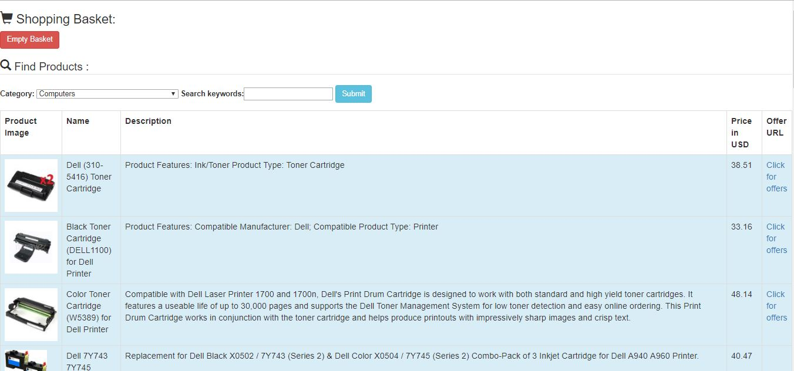
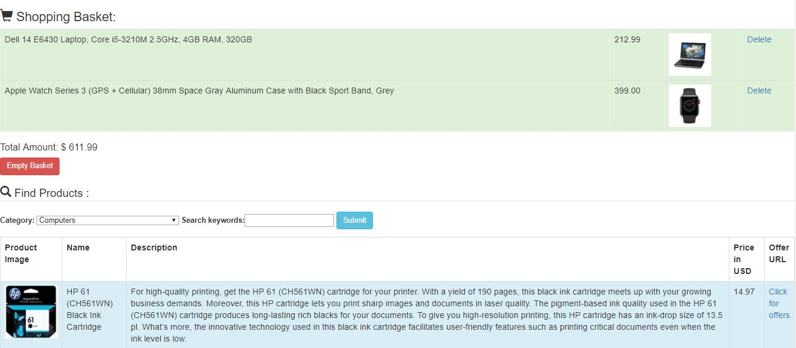

# Shopaholic
PHP, Bootstrap, Ebay Commerce Network API

A simple sample application to demonstrate the use of REST APIs
and sessions in PHP. It fetches the products based on the user's 
search keyword and displays the available products to her. The user 
can then select products and add them to her cart.

## How to run ?

Clone the repository into your htdocs diretory under xampp. 
Insert your API key in the indicated places in buy.php
Run Apache server
Open buy.php on the browser

## Contributing

1. Fork it!
2. Create your feature branch: `git checkout -b my-new-feature`
3. Commit your changes: `git commit -am 'Add some feature'`
4. Push to the branch: `git push origin my-new-feature`
5. Submit a pull request :D

## License

Abhinaya Ramachandran 2017
